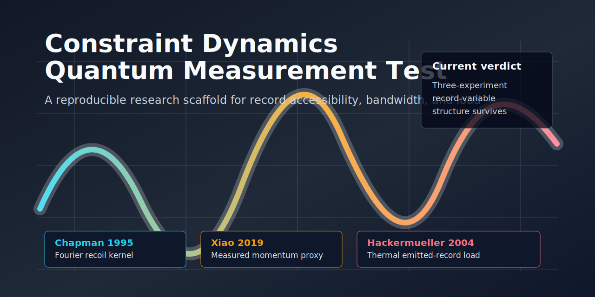
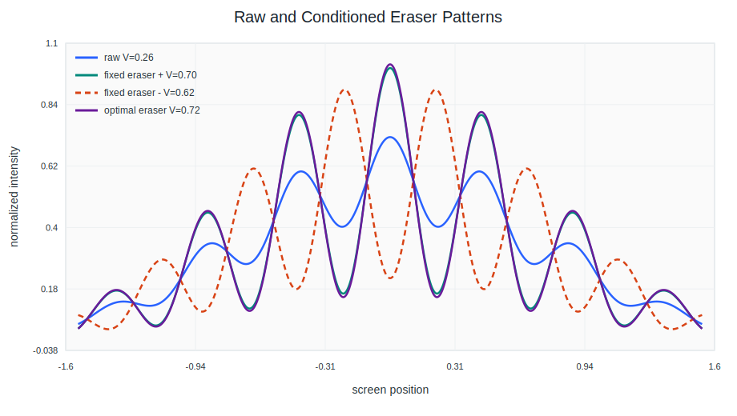
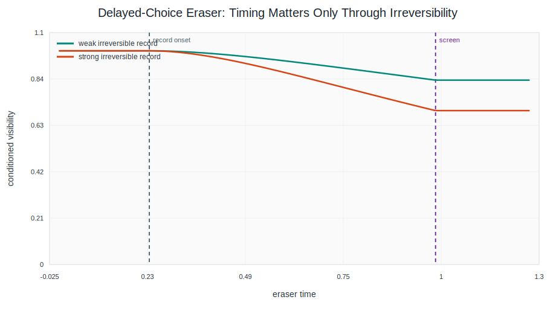
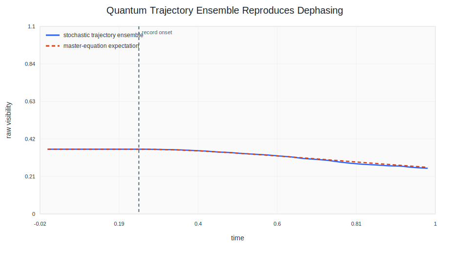
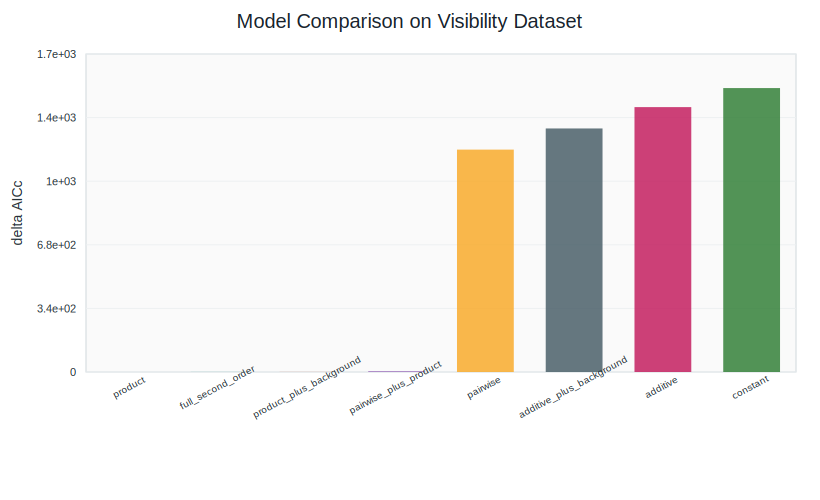
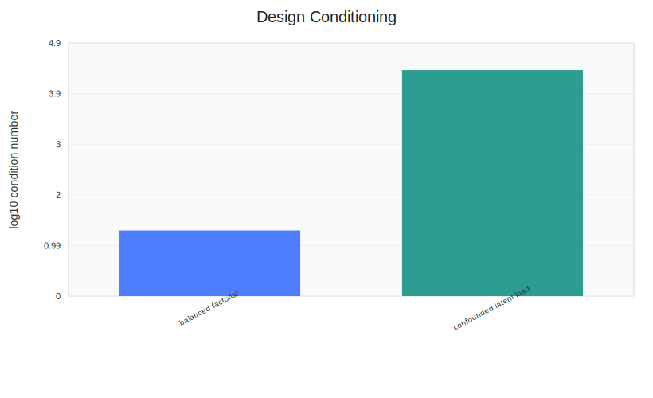
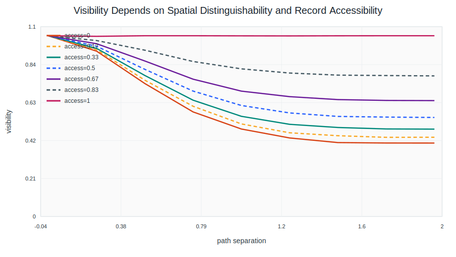

# Constraint Dynamics Quantum Measurement Test



Exploratory, falsifiable scaffold for testing whether record accessibility, record bandwidth, and durable environmental record load organize apparatus-dependent quantum visibility loss across standard quantum-measurement and decoherence experiments.

[](https://github.com/workingclassbuddha/cd-quantum-measurement/actions/workflows/tests.yml)


## At A Glance

This repository is a research scaffold, not a finished theory of collapse. It turns a Constraint Dynamics question into reproducible empirical tests:

```text
Does visibility loss track generic dephasing strength,
or does it track what kind of record the apparatus/environment has made?
```

Current answer: across Chapman 1995, Xiao 2019, and Hackermueller 2004, the stronger conservative signal is a record-variable structure:

- Chapman: unresolved photon momentum records behave like a Fourier kernel, not a monotone exponential.
- Xiao: reconstructed momentum-disturbance distributions predict visibility loss in a no-refit cross-figure check.
- Hackermueller: thermal emitted-photon record load survives bootstrap stress better than a plain scalar exp(power) baseline.

The allowed claim is narrow:

```text
Record accessibility / bandwidth / load is a useful empirical organizing variable
across standard-QM measurement and decoherence experiments.
```

The disallowed claims are equally important: this does not solve collapse, validate the Lambda/Gamma/Theta product law, or show physics beyond standard quantum mechanics.

## Current Research State

The strongest current result is not a collapse claim or a validated product law. It is a cross-experiment empirical target:

```text
Theta is better treated as record accessibility / bandwidth / load
than as generic entropy load or scalar dephasing strength.
```

The Chapman 1995 pass shows raw visibility is better captured by a Fourier/sinc-style momentum-record kernel than by monotone exponential dephasing. The Xiao 2019 pass independently reconstructs a momentum-disturbance scale that tracks visibility loss tightly and shows distributional side peaks. The Hackermueller 2004 pass adds an irreversible environmental-record lane: thermal emitted-photon load survives a 1000-sample uncertainty bootstrap against plain exp(power). Hornberger 2003 adds a collisional-decoherence guardrail whose methane pressure scale is internally consistent across visibility and gas-species figures. The synthesis command currently labels this:

```text
three-experiment structure survives with Hornberger guardrail
```

Representative current numbers:

```text
Chapman sinc RMSE / exponential RMSE: 0.0257 / 0.0738
Chapman first zero: d/lambda = 0.510
Xiao linear bandwidth RMSE / published-bound RMSE: 0.0034 / 0.0693
Xiao stress P(linear beats bound): 1.000
Xiao pairing-null p: 0.004
Xiao vector phi=pi side-peak |p|: 1.613
Xiao vector Fig. 3 distribution no-refit prediction RMSE: 0.0133
Xiao vector stress P(no-refit beats bound): 1.000
Hackermueller thermal delta-T4 RMSE / exp(power) RMSE: 0.0767 / 0.0923
Hackermueller stress P(thermal beats exp power): 0.994
```

The next breakthrough-grade test is a held-out experiment where an independently measured record distribution predicts visibility without refitting the bandwidth.

The central V3 hypothesis is:

```text
kappa_eff = kappa0 * Lambda * Gamma * Theta
visibility_raw = marker_visibility * exp(-2 * kappa_eff * t_eff)
```

This is not a derivation of wavefunction collapse. It is not a replacement for standard decoherence theory. It is a compact way to ask whether spatial selectivity, temporal resolution, and irreversible record load explain measurement-induced classicalization better than constant, additive, or pairwise parameterizations.

## What V3 Adds

- Joint path-plus-marker density matrix for reversible which-path marking.
- Quantum eraser conditioning that restores only reversible marker information.
- Timing-aware delayed-choice branch: delay matters only when an irreversible record has begun to lock in.
- Stochastic phase-flip trajectory simulation whose ensemble reproduces the master-equation dephasing curve.
- Apparatus-to-constraint mappings for Lambda, Gamma, and Theta.
- Model comparison across constant, product, additive, pairwise, and extended interaction laws using AICc, BIC, Akaike weights, and k-fold cross-validation.
- Identifiability diagnostics for deciding whether a dataset actually separates Lambda, Gamma, and Theta.
- Eraser decomposition utility for paired raw/conditioned literature visibility data.
- Accessibility benchmark for testing whether "inaccessible record load" makes a discriminating prediction.

## Quick Start

Install dependencies in your preferred Python environment:

```bash
python -m pip install -r requirements.txt
```

Run the test suite:

```bash
python -m pytest -q
```

Generate the demo outputs:

```bash
python src/constraint_dynamics_quantum_v3.py demo --output-dir outputs --data-dir data
```

Fit your own visibility dataset:

```bash
python src/constraint_dynamics_quantum_v3.py fit --input data/visibility_fit_template.csv --output-dir outputs
```

Diagnose whether a dataset is separable enough to interpret:

```bash
python src/constraint_dynamics_quantum_v3.py design --input data/visibility_fit_template.csv --output-dir outputs/design_diagnostics
```

Decompose paired raw/conditioned quantum eraser visibility data:

```bash
python src/constraint_dynamics_quantum_v3.py decompose-eraser --input data/extracted/CHAPMAN_1995_SCATTER.csv --output-dir outputs/chapman
```

Regenerate the calibrated Chapman extraction:

```bash
python src/constraint_dynamics_quantum_v3.py digitize-chapman --pdf /tmp/chapman_prl95.pdf --output-dir outputs/chapman_digitization --data-dir data/extracted
python src/constraint_dynamics_quantum_v3.py decompose-eraser --input data/extracted/CHAPMAN_1995_SCATTER_DIGITIZED.csv --output-dir outputs/chapman_digitized
```

Analyze Chapman as a Fourier kernel over unresolved photon momentum records:

```bash
python src/constraint_dynamics_quantum_v3.py analyze-chapman-kernel --input data/extracted/CHAPMAN_1995_SCATTER_DIGITIZED.csv --output-dir outputs/chapman_kernel
```

Stress-test the Chapman kernel result with visibility bootstrap and null controls:

```bash
python src/constraint_dynamics_quantum_v3.py stress-test-chapman-kernel --input data/extracted/CHAPMAN_1995_SCATTER_DIGITIZED.csv --digitization-json data/extracted/CHAPMAN_1995_DIGITIZATION.json --output-dir outputs/chapman_kernel_stress --n-bootstrap 1000 --seed 20260424
```

Fit Chapman Eq. (3) as a physical recoil/acceptance-kernel model:

```bash
python src/constraint_dynamics_quantum_v3.py analyze-chapman-physical-kernel --input data/extracted/CHAPMAN_1995_SCATTER_DIGITIZED.csv --digitization-json data/extracted/CHAPMAN_1995_DIGITIZATION.json --output-dir outputs/chapman_physical_kernel
```

Run the overconstrained complex Chapman phase test:

```bash
python src/constraint_dynamics_quantum_v3.py analyze-chapman-complex-kernel --pdf /tmp/chapman_prl95.pdf --data-dir data/extracted --output-dir outputs/chapman_complex_kernel
```

Test whether Chapman-style 0/1/2-photon mixture terms repair the raw phase failure:

```bash
python src/constraint_dynamics_quantum_v3.py analyze-chapman-complex-mixture --pdf /tmp/chapman_prl95.pdf --data-dir data/extracted --output-dir outputs/chapman_complex_mixture
```

Redigitize Fig. 2 raw phase with explicit unwrap and quality masks:

```bash
python src/constraint_dynamics_quantum_v3.py digitize-chapman-phase-grade --pdf /tmp/chapman_prl95.pdf --data-dir data/extracted --output-dir outputs/chapman_phase_grade
```

Digitize and analyze Xiao et al. 2019 as a second record-bandwidth target:

```bash
python src/constraint_dynamics_quantum_v3.py digitize-xiao-momentum --source-dir outputs/tmp/second_hunt_sources/xiao --output-dir outputs/xiao_momentum_digitization --data-dir data/extracted
python src/constraint_dynamics_quantum_v3.py analyze-xiao-momentum --input data/extracted/XIAO_2019_MOMENTUM_VISIBILITY_DIGITIZED.csv --output-dir outputs/xiao_momentum
python src/constraint_dynamics_quantum_v3.py stress-test-xiao-momentum --input data/extracted/XIAO_2019_MOMENTUM_VISIBILITY_DIGITIZED.csv --digitization-json data/extracted/XIAO_2019_MOMENTUM_DIGITIZATION.json --output-dir outputs/xiao_momentum_stress --n-bootstrap 1000 --seed 20260424
python src/constraint_dynamics_quantum_v3.py digitize-xiao-probability --source-dir outputs/tmp/second_hunt_sources/xiao --output-dir outputs/xiao_probability --data-dir data/extracted
python src/constraint_dynamics_quantum_v3.py digitize-xiao-probability-vector --source-dir outputs/tmp/second_hunt_sources/xiao --output-dir outputs/xiao_probability_vector --data-dir data/extracted
python src/constraint_dynamics_quantum_v3.py predict-xiao-visibility-from-distribution --momentum-input data/extracted/XIAO_2019_MOMENTUM_VISIBILITY_DIGITIZED.csv --probability-input data/extracted/XIAO_2019_PROBABILITY_DIGITIZED.csv --output-dir outputs/xiao_distribution_prediction
python src/constraint_dynamics_quantum_v3.py stress-test-xiao-distribution-prediction --momentum-input data/extracted/XIAO_2019_MOMENTUM_VISIBILITY_DIGITIZED.csv --probability-input data/extracted/XIAO_2019_PROBABILITY_DIGITIZED.csv --output-dir outputs/xiao_distribution_prediction_stress --n-bootstrap 1000 --seed 20260425
python src/constraint_dynamics_quantum_v3.py predict-xiao-visibility-from-distribution --momentum-input data/extracted/XIAO_2019_MOMENTUM_VISIBILITY_DIGITIZED.csv --probability-input data/extracted/XIAO_2019_PROBABILITY_VECTOR_DIGITIZED.csv --output-dir outputs/xiao_distribution_prediction_vector
python src/constraint_dynamics_quantum_v3.py stress-test-xiao-distribution-prediction --momentum-input data/extracted/XIAO_2019_MOMENTUM_VISIBILITY_DIGITIZED.csv --probability-input data/extracted/XIAO_2019_PROBABILITY_VECTOR_DIGITIZED.csv --output-dir outputs/xiao_distribution_prediction_vector_stress --n-bootstrap 1000 --seed 20260425
```

Scout Cormann et al. 2016 as a third visibility-plus-phase control:

```bash
python src/constraint_dynamics_quantum_v3.py scout-cormann-visibility-phase --source-dir outputs/tmp/third_hunt_sources/cormann --output-dir outputs/third_hunt_scout/cormann --data-dir data/extracted
```

Digitize, analyze, and stress-test Hackermueller et al. 2004 as the third durable-record lane:

```bash
python src/constraint_dynamics_quantum_v3.py digitize-hackermueller-thermal --source-dir outputs/tmp/third_hunt_sources/hackermueller --output-dir outputs/hackermueller_thermal_digitization --data-dir data/extracted
python src/constraint_dynamics_quantum_v3.py analyze-thermal-decoherence --input data/extracted/HACKERMUELLER_2004_THERMAL_DIGITIZED.csv --output-dir outputs/hackermueller_thermal
python src/constraint_dynamics_quantum_v3.py stress-test-hackermueller-thermal --input data/extracted/HACKERMUELLER_2004_THERMAL_DIGITIZED.csv --digitization-json data/extracted/HACKERMUELLER_2004_THERMAL_DIGITIZATION.json --output-dir outputs/hackermueller_thermal_stress --n-bootstrap 1000 --seed 20260430
```

Synthesize the Chapman, Xiao, and Hackermueller record-variable results without fitting a shared product law:

```bash
python src/constraint_dynamics_quantum_v3.py synthesize-record-bandwidth --output-dir outputs/record_bandwidth_synthesis
```

Score the current evidence against strict breakthrough-readiness gates:

```bash
python src/constraint_dynamics_quantum_v3.py evaluate-breakthrough-candidate --output-dir outputs/breakthrough_candidate
```

Rank candidate experiments for the missing second no-refit distribution gate, then run the best recoil-control scout:

```bash
python src/constraint_dynamics_quantum_v3.py scout-no-refit-targets --output-dir outputs/no_refit_target_scout
python src/constraint_dynamics_quantum_v3.py audit-breakthrough-gaps --output-dir outputs/breakthrough_gap_audit
python src/constraint_dynamics_quantum_v3.py audit-public-data-availability --output-dir outputs/public_data_availability
python src/constraint_dynamics_quantum_v3.py audit-public-g11-exhaustion --output-dir outputs/public_g11_exhaustion
python src/constraint_dynamics_quantum_v3.py audit-breakthrough-path-exhaustion --output-dir outputs/breakthrough_path_exhaustion
python src/constraint_dynamics_quantum_v3.py audit-g11-closure-readiness --output-dir outputs/g11_closure_readiness
python src/constraint_dynamics_quantum_v3.py prepare-author-data-intake --output-dir outputs/author_data_intake
python src/constraint_dynamics_quantum_v3.py validate-author-data-manifest --manifest outputs/author_data_intake/author_data_received_manifest_template.csv --schema outputs/author_data_intake/author_data_intake_schema.csv --output-dir outputs/author_data_validation
python src/constraint_dynamics_quantum_v3.py audit-current-goal-status --output-dir outputs/current_goal_audit
python src/constraint_dynamics_quantum_v3.py scout-eibenberger-recoil-absorption --source-dir outputs/tmp/second_no_refit_sources/eibenberger --output-dir outputs/eibenberger_recoil_scout --data-dir data/extracted
python src/constraint_dynamics_quantum_v3.py scout-mir-weak-value --source-dir outputs/tmp/second_no_refit_sources/mir --output-dir outputs/mir_weak_value_scout --data-dir data/extracted
python src/constraint_dynamics_quantum_v3.py check-mir-fig4-eraser-phase --source-dir outputs/tmp/second_no_refit_sources/mir --output-dir outputs/mir_fig4_eraser_phase --data-dir data/extracted
python src/constraint_dynamics_quantum_v3.py check-kokorowski-detector-convolution --input data/extracted/KOKOROWSKI_2001_MULTIPHOTON_DIGITIZED.csv --output-dir outputs/kokorowski_detector_convolution
python src/constraint_dynamics_quantum_v3.py scout-hochrainer-momentum-correlation --source-dir outputs/tmp/second_no_refit_sources/hochrainer --output-dir outputs/hochrainer_momentum_correlation_scout --data-dir data/extracted
python src/constraint_dynamics_quantum_v3.py scout-hornberger-collisional --source-dir outputs/tmp/third_hunt_sources/hornberger --output-dir outputs/hornberger_collisional_scout --data-dir data/extracted
```

Scout the third held-out irreversible-record dataset:

```text
docs/third_experiment_hunt.md
outputs/third_hunt_scout/third_dataset_candidate_register.csv
outputs/third_hunt_scout/third_dataset_scout_report.md
```

Current third-dataset verdict: Hackermueller thermal-emission decoherence survives the current uncertainty stress as a durable-record load lane, with Hornberger 2003 collisional decoherence as the backup.

Generate the balanced-vs-confounded benchmark:

```bash
python src/constraint_dynamics_quantum_v3.py benchmark-designs --output-dir outputs
```

Generate the record-accessibility benchmark:

```bash
python src/constraint_dynamics_quantum_v3.py benchmark-accessibility --output-dir outputs/accessibility_benchmark
```

## Repository Layout

```text
README.md
theory_notes.md
methods_note.md
docs/literature_review.md
docs/experimental_design.md
docs/literature_data_plan.md
docs/breakthrough_hunt.md
docs/second_experiment_hunt.md
docs/v2_audit.md
src/constraint_dynamics_quantum_v3.py
data/visibility_fit_template.csv
data/literature_study_register.csv
data/extracted/CHAPMAN_1995_SCATTER.csv
data/extracted/CHAPMAN_1995_SCATTER_DIGITIZED.csv
data/extracted/CHAPMAN_1995_DIGITIZATION.json
data/extracted/CHAPMAN_1995_PHASE_DIGITIZED.csv
data/extracted/CHAPMAN_1995_COMPLEX_DIGITIZATION.json
data/extracted/CHAPMAN_1995_PHASE_GRADED.csv
data/extracted/CHAPMAN_1995_PHASE_GRADE_DIGITIZATION.json
data/extracted/XIAO_2019_MOMENTUM_VISIBILITY_DIGITIZED.csv
data/extracted/XIAO_2019_MOMENTUM_DIGITIZATION.json
data/extracted/XIAO_2019_PROBABILITY_DIGITIZED.csv
data/extracted/XIAO_2019_PROBABILITY_DIGITIZATION.json
outputs/figures/
outputs/chapman/
outputs/chapman_digitized/
outputs/chapman_digitization/
outputs/chapman_kernel/
outputs/chapman_kernel_stress/
outputs/chapman_physical_kernel/
outputs/chapman_complex_kernel/
outputs/chapman_complex_mixture/
outputs/chapman_phase_grade/
outputs/second_hunt_scout/
outputs/xiao_momentum_digitization/
outputs/xiao_momentum/
outputs/xiao_momentum_stress/
outputs/xiao_probability/
outputs/xiao_probability_vector/
outputs/xiao_distribution_prediction/
outputs/xiao_distribution_prediction_stress/
outputs/xiao_distribution_prediction_vector/
outputs/xiao_distribution_prediction_vector_stress/
outputs/record_bandwidth_synthesis/
outputs/accessibility_benchmark/
outputs/demo_fit_summary.csv
```

## Demo Figures













## Minimal Data Schema

You can provide either direct constraint columns:

```text
Lambda,Gamma,Theta,marker_visibility,t_meas,visibility_obs
```

or apparatus columns that V3 maps into constraints:

```text
path_separation,detector_spatial_resolution,coherence_time,
detector_response_time,record_entropy_bits,
record_survival_probability,environment_coupling,
record_accessibility,
marker_angle,t_meas,visibility_obs
```

`visibility_se` is optional and used as a fitting weight when present.

## Limits

The model respects standard quantum eraser behavior: reversible path marking can suppress raw interference, conditioned eraser data can recover it, and irreversible dephasing cannot be recovered by changing the marker basis later. The claims here remain effective and phenomenological until real apparatus datasets can discriminate the product law from alternatives.

Use [docs/experimental_design.md](docs/experimental_design.md) before taking a product-law fit seriously. The scaffold now treats high factor correlation and poor design conditioning as first-class warnings rather than afterthoughts.

The calibrated literature extractions store axis anchors, point picks, source hashes, uncertainty estimates, and provenance. They support reproducible exploratory checks, not standalone publication-grade metrology.

The Chapman kernel analysis adds a sharper caution: the raw Chapman curve has a zero-and-revival structure better captured by an absolute sinc/Fourier window than by scalar monotone exponential dephasing. In this setting, `Theta` is best treated as inaccessible conjugate-record bandwidth, not just generic entropy load.

The stress test makes the verdict stricter. In the current run, the raw sinc/Fourier advantage survives bootstrap uncertainty, but the broader conditioned-branch bandwidth ordering remains fragile under null controls. That means the raw Fourier-kernel signal is real enough to pursue, while the full Constraint Dynamics interpretation still needs better digitization or a second real experiment.

The physical acceptance-kernel command implements Chapman Eq. (3) directly as a characteristic function over photon momentum-transfer records. It improves the conditioned branch fits and recovers the forward/backward center ordering, but those centers are still inferred from contrast rather than independently measured detector acceptance geometry.

The complex-kernel command adds rough Chapman phase digitization and asks whether one inferred record distribution family predicts both visibility and phase. The current run recovers conditioned forward/backward phase ordering, but raw full-phase error remains too large. The verdict is not a breakthrough: phase currently breaks or underdetermines the stronger record-accessibility model.

The complex-mixture command tests whether that raw phase failure is caused by missing Chapman-style 0-photon, 1-photon, 2-photon, and velocity-smearing terms. Its report uses strict labels: `raw phase repaired`, `digitization-limited`, or `model still fails`. The current run is `model still fails`: conditioned ordering survives, but raw phase improves only slightly and raw visibility gets worse.

The Xiao pass gives the best second-experiment support so far. Fig. 4 produces a tight relation between visibility loss and reconstructed momentum-disturbance scale, the stress test survives digitization uncertainty and pairing nulls, and the probability-distribution extraction shows side peaks in the `phi=pi` branch while `phi=0` remains centered. The Hackermueller pass adds a third durable-record load check: thermal delta-T4 beats plain exp(power) in the current calibrated EPS-rendered Figure 4 pass and survives the uncertainty bootstrap. Hornberger adds a collisional-decoherence guardrail: methane visibility gives `p_v = 0.807 x 10^-6 mbar`, matching the Fig. 3 CH4 scale `0.810 x 10^-6 mbar`. The synthesis command therefore labels the current state `three-experiment structure survives with Hornberger guardrail`. That is a promising empirical structure, not a breakthrough: it still does not validate the product law, solve collapse, or establish physics beyond standard quantum mechanics.

The phase-grade command redigitizes the Fig. 2 raw phase panel with explicit displayed phase, unwrapped phase, unwrap groups, quality labels, and wrap/low-contrast ambiguity flags. It reruns the complex and mixture analyses on all phase points and on a high-confidence raw subset. The current focused-grid run is `phase still fails`: the high-confidence mask does not rescue raw phase, though conditioned forward/backward ordering remains intact. The raw-phase blocker audit now also runs a whole-unwrap-group `±2π` branch search; the best branch-optimized RMSE still misses the 0.75 rad gate, so simple branch relabeling does not repair G10.

The Xiao momentum command is the first second-experiment pass. It digitizes Fig. 4 from Xiao et al. 2019, where reconstructed total mean absolute momentum disturbance is plotted against remaining visibility in partial which-way measurements. The current result is `candidate cross-experiment structure`: the six extracted points are monotone, all lie above the published lower-bound line, and a simple linear bandwidth proxy fits tightly. This strengthens the record-bandwidth target, but it still does not validate the product law or make any beyond-standard-quantum claim.

The Xiao stress command jitters the digitized visibility and momentum values and runs a pairing-null control. The current 1000-sample run is `xiao relation survives uncertainty`: the linear bandwidth proxy beats the published-bound and scaled-loss fits in all bootstrap samples, all points remain above the published lower bound, and the pairing null reaches the observed correlation/RMSE only about 0.4% of the time. This makes Xiao a robust second empirical target, not a breakthrough claim.

The Xiao probability command digitizes Fig. 3 from `probability.pdf`. The raster run is `probability distribution supports record-bandwidth target`: mean absolute disturbance grows by about 0.568 hbar/d across propagation, the `phi=0` far-field distribution is centered near p = -0.022, and the `phi=pi` branch develops side peaks with mean absolute location |p| = 1.586. The vector command improves the bottleneck by reading the Fig. 3b red/blue curves directly from PDF path commands; its current branch moments are `M_phi0 = 0.0610` and `M_phipi = 1.4112`.

The Xiao distribution-prediction command is the current sharpest no-refit check. It computes branch mean momentum disturbance from Fig. 3b, maps visibility to the paper's phase-mixture weights, and predicts Fig. 4 without fitting the bandwidth to Fig. 4. With vector Fig. 3b extraction, `distribution_no_refit` has RMSE 0.0133, compared with 0.0693 for the published-bound line and 0.0034 for a direct Fig. 4 linear refit. The breakthrough-readiness dossier now labels this `lead candidate found, breakthrough not yet`: Xiao passes the core no-refit and null gates, while Chapman raw phase, a second independent distribution-to-visibility dataset, and product-law validation remain open blockers.

The vector-aware stress test now survives its configured robustness checks: `P(no-refit beats published bound) = 1.000`, `P(no-refit RMSE < 0.025) = 0.957`, pairing-null `P(RMSE <= observed) = 0.003`, and branch-label-swap `P(RMSE <= observed) = 0.000`. The caveat is important: this is a within-paper cross-figure prediction with vector-coordinate uncertainty, not an independent apparatus validation.

The second-target scout now identifies Kokorowski 2001 as the single eligible public second-experiment lead, while still refusing closure. The gap audit writes `outputs/breakthrough_gap_audit/g11_gap_audit_report.md` and currently reports `eligible_second_no_refit_targets = 1`. Kokorowski Fig. 4 vector digitization gives an independent-kappa no-refit RMSE of `0.0240`, branch-swap and shuffle nulls are crushed, and the detector-convolution check reconstructs the reported calculated kappa-prime values from public formulae within two reported SE (`max delta = 0.088 k0`). The blocker is still real: the public source exposes summarized beam-deflection/broadening calibration values, not the raw calibration tables needed to tighten independent-kappa uncertainty enough for publication-grade G11 closure.

The live G11 coordination thread is [issue #1](https://github.com/workingclassbuddha/cd-quantum-measurement/issues/1). Author-data request trackers are open for [Xiao 2019](https://github.com/workingclassbuddha/cd-quantum-measurement/issues/2), [Hochrainer 2017](https://github.com/workingclassbuddha/cd-quantum-measurement/issues/3), [Mir 2007](https://github.com/workingclassbuddha/cd-quantum-measurement/issues/4), and [Eibenberger 2014](https://github.com/workingclassbuddha/cd-quantum-measurement/issues/5).

The author-data intake command writes schemas and manifest templates for received numerical data. It explicitly marks Xiao as lead calibration only, while Hochrainer, Mir, and Eibenberger can affect G11 only if their record-width/distribution/load variable is independent of the visibility curve being predicted.

The manifest validator checks received rows against those schemas. The committed empty-template validation currently reports `g11_ready_rows = 0`.

The public G11 exhaustion audit writes `outputs/public_g11_exhaustion/public_g11_exhaustion_report.md`; it currently reports `current_public_g11_path_exhausted = True` without closing G11. The breakthrough-path exhaustion audit writes `outputs/breakthrough_path_exhaustion/breakthrough_path_exhaustion_report.md`; it records the currently implemented path as exhausted without closure and lists the new numerical inputs needed before the claim can move. The G11 closure-readiness audit writes `outputs/g11_closure_readiness/g11_closure_readiness_report.md`; it defines the seven acceptance gates any future second validation must clear before updating the breakthrough scorecard. The current-goal audit writes `outputs/current_goal_audit/current_goal_completion_audit.md`; it currently reports `objective_achieved = False` with G10, G11, and G12 still open.

The Mir weak-value scout is the closest historical near miss. The arXiv source includes Fig. 3, an unconditional weak-valued momentum-transfer distribution `P_wv(q)`, and Fig. 4 quantum-eraser conditional patterns. The scout verdict is `measured momentum-transfer distribution found, visibility sweep missing`: useful as a weak-value/momentum-transfer control, but it does not clear the missing second no-refit distribution-to-visibility gate. The `check-mir-fig4-eraser-phase` command now extracts the Fig. 4a/4b PostScript diamond intensity markers and records a public-vector eraser phase-control check; it is supporting near-miss evidence only, because Fig. 4 is not a controlled visibility-loss sweep.

The Hochrainer induced-coherence scout is a strong inverse-problem near miss. The paper explicitly links visibility profiles to the conditional transverse momentum probability density, and Fig. 3 reports momentum-correlation width versus pump waist. The scout verdict is `visibility-derived momentum-correlation near miss`: relevant to record bandwidth, but not independent enough because the record width is computed from visibility FWHM.

The Hornberger collisional scout now adds the standard-decoherence guardrail. Scout Fig. 2 methane visibility gives a fitted decoherence pressure `p_v = 0.807 x 10^-6 mbar`, while Fig. 3 CH4 gives `0.810 x 10^-6 mbar`; gas-species theory vs experiment has pressure RMSE `0.185 x 10^-6 mbar` and correlation `0.888`. This supports the environmental-record-load lane, but it is deliberately not counted as the missing Xiao-like no-refit distribution test.

The Cormann scout adds a third-candidate check, but not a new record-bandwidth win. It extracts `VisibilityPhaseMeasurement.eps` from the arXiv source package and compares visibility against the paper's caption parameters without refitting. Setup 1 and 2 visibility are usable (`RMSE = 0.0357` and `0.0655`), phase-sign accuracy averages `0.877`, and setup 3 is too noisy/occluded in the current scout. Verdict: useful as a phase-control dataset, not the held-out distribution-to-visibility breakthrough test.
